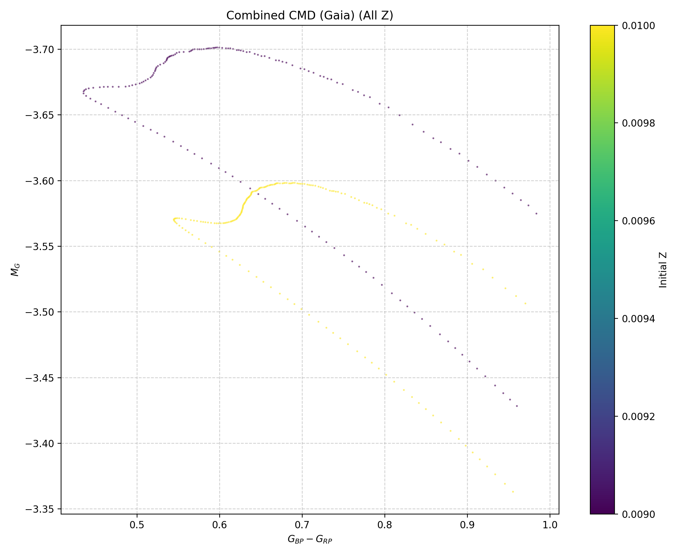
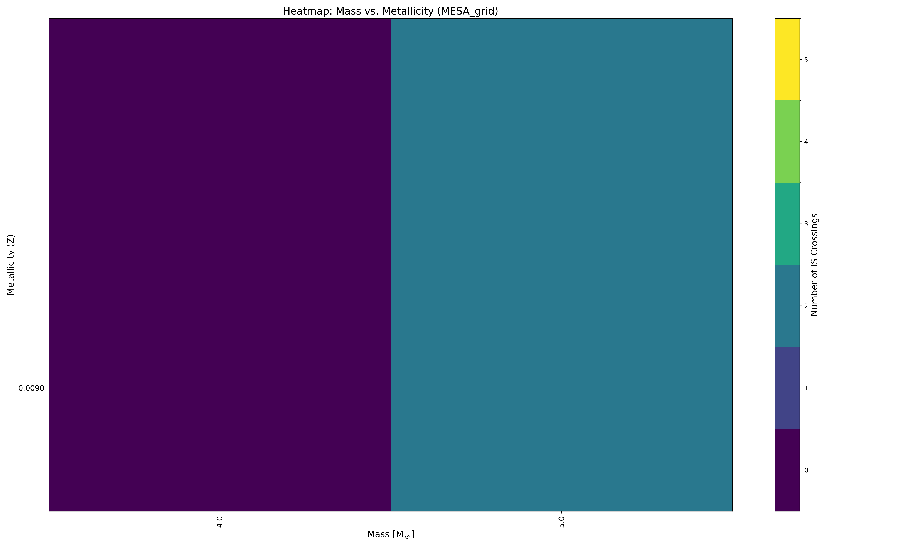

Tutorial 1: Analyzing ``example`` grids: MIST synthetic: ``example/MIST_synthetic``
===================================================================================

This **dataset**, located within the ``example/MIST_synthetic`` directory, consists of synthetic stellar evolution tracks obtained from the `MIST (MESA Isochrones & Stellar Tracks) website <http://waps.cfa.harvard.edu/MIST/>`_. This dataset is generated to provide a **quick and efficient way to demonstrate `mesalab`'s data pre-processing and basic analysis capabilities**, such as parsing input files and extracting fundamental stellar parameters.

Since `mesalab` is primarily optimized for MESA's ``history.data`` file format, the EEP (Equal-Evolutionary-Phase) files directly downloadable from MIST have been converted into **quasi-history files**. These converted files mimic the structure and header of standard MESA ``history.data`` outputs. A ``model_number`` column has been arbitrarily added and populated with sequential numbers starting from 1 to ensure compatibility.

Additionally, as the MIST website only provides EEP files, **dummy** ``inlist`` **files have been created for each track**. These dummy files contain only the stellar mass and initial metallicity, as **this specific information is required by** `mesalab` **for its analysis workflows**.

* **Grid Structure & Paramteres:** It contains a **4x6 grid** of models with a rotational velocity ratio of **v/vcrit = 0**, stellar masses ranging from **2.1 to 12.1 solar masses**, and metallicities (:math:`[Fe/H]`) of **-1, 0 and +0.5**. The metallicity :math:`[Fe/H]` values can be converted to the MESA abundance :math:`Z` (the mass fraction of elements heavier than helium) using the following formula, typically with a solar reference :math:`Z_{\odot}/X_{\odot} \approx 0.0207` (for :math:`Z_{\odot}=0.0142, X_{\odot}=0.7154`):

    :math:`\frac{Z}{X} = \frac{Z_{\odot}}{X_{\odot}} \times 10^{[Fe/H]}`

    Where :math:`X` is the mass fraction of hydrogen, and :math:`X_{\odot}` and :math:`Z_{\odot}` are the solar mass fractions of hydrogen and metals, respectively.

* **Evolutionary Coverage:** Simulations cover stellar evolution from the **pre-main sequence (pre-MS)** through to **after the blue loop phase**.

* **Blue Loop Behavior:** The grid includes models with evolutionary behaviors, including:

    * Tracks that exhibit a **blue loop** phase.
    * Tracks that **do not** undergo a blue loop.
    * Tracks that **have not yet reached the Red Giant Branch (RGB) tip**.

* **Location:** These models are found in the ``example/MIST_synthetic`` directory.

* **YAML Configuration File:** The corresponding ``example_MIST.yaml`` configuration file set up is responsible to identify blue loops and generate plots.

----

Run MIST synthetic example
~~~~~~~~~~~~~~~~~~~~~~~~~~

You can easily run your first example by executing `mesalab` with the provided configuration file:

.. code-block:: console

    $ mesalab --config example/example_MIST.yaml

Upon execution, you'll see terminal output similar to this:

.. code-block:: console

    ================================================================================
                        mesalab CLI - Starting Analysis Workflow                    
                                  Version: 1.1.0                               
    ================================================================================

    ======================================================================
        Starting MESA Analysis Workflow...
    ======================================================================

    Performing MESA Run Analysis:   5%|███▋                                                                         | 1/21 [00:00<00:06,  3.10it/s]2025-07-17 13:36:53,212 - WARNING: Warning: No hydrogen exhaustion found for M=12.1, Z=0.0449043 (star might be too young or still on MS).
    Warning: No hydrogen exhaustion found for M=12.1, Z=0.0449043 (star might be too young or still on MS).                                        
    Performing MESA Run Analysis: 100%|████████████████████████████████████████████████████████████████████████████| 21/21 [00:03<00:00,  6.85it/s]

    ======================================================================
        MESA Analysis Workflow Completed Successfully.
    ======================================================================

    ======================================================================
        Starting Plotting Workflow...
    ======================================================================

    ======================================================================
        Full Instability Strip Crossings Matrix (for Heatmap):
    ======================================================================
               2.1   4.6   6.1   7.6   9.1   10.6  12.1
    initial_Z                                          
    0.001420    0.0   2.0   2.0   2.0   2.0   2.0   0.0
    0.014200    0.0   0.0   2.0   2.0   2.0   1.0   0.0
    0.044904    0.0   0.0   0.0   0.0   0.0   0.0   0.0
    ======================================================================

    Calculating BCs serially: 100%|██████████████████████████████████████████████████████████████████████████████| 526/526 [00:05<00:00, 96.71it/s]

    ======================================================================
        Plotting Workflow Completed Successfully.
    ======================================================================

    ======================================================================
        GYRE workflow is disabled in configuration (run_gyre_workflow=False).
    ======================================================================

    ================================================================================
    ║                   mesalab Workflow Finished Successfully!                    ║
    ================================================================================

After the workflow completes, you will find the generated plots in the `example/MIST_synthetic_output/plots` directory. Here are some examples of the plots generated for this grid:

   Gaia Color-Magnitude Diagram (CMD) for the 5 Msun models that undergo blue loop evolution. This plot specifically focuses on models that are currently within the blue loop phase and have crossed the red (cool) boundary of the Instability Strip (IS), indicating evolutionary stages relevant for pulsating stars.

   Heatmap visualizing the number of instability strip crossings for different initial masses and metallicities.

