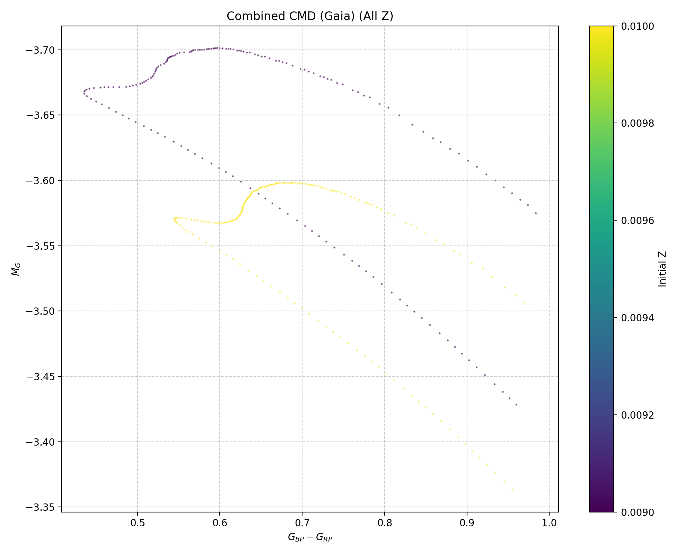
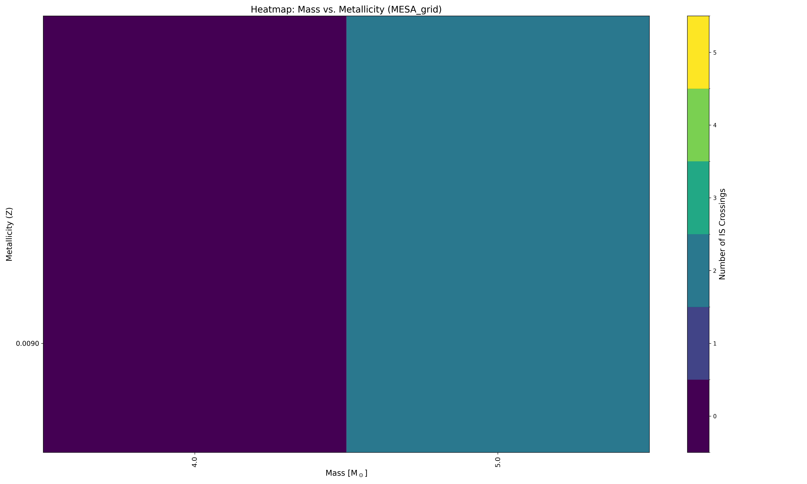

.. _tutorial_2:

Tutorial 2.: Running an Example Analysis in ``mesalab`` with Google Colab
=========================================================================

.. image:: https://colab.research.google.com/assets/colab-badge.svg
     :target: https://colab.research.google.com/github/tnehezd/mesa_blue_loop/blob/main/docs/colab_notebooks/mesalab_mesa_grid_base_tutorial.ipynb

This tutorial will guide you through running a full ``mesalab`` analysis
within a Google Colab environment. We’ll set up ``mesalab``, process a
sample of real MESA data to identify specific stellar phenomena, and
inspect the results.

The provided example data allows you to test ``mesalab``\ ’s core
functionality for filtering MESA outputs **without** needing to install
the MESA SDK, GYRE, or RSP.

.. note::

    The full tutorial is available at the following Colab link:

    .. image:: https://colab.research.google.com/assets/colab-badge.svg
         :target: https://colab.research.google.com/github/tnehezd/mesa_blue_loop/blob/main/docs/colab_notebooks/mesalab_mesa_grid_base_tutorial.ipynb

--------------

Prerequisites
~~~~~~~~~~~~~

-  An active Google account (for Colab access).

--------------

1. Set up ``mesalab`` and Get Example Data
------------------------------------------

1.1 Clone the ``mesalab`` repository
^^^^^^^^^^^^^^^^^^^^^^^^^^^^^^^^^^^^

First, clone the ``mesalab`` repository from GitHub. This will give you
access to the source code and the ``example/`` directory containing the
sample MESA data and configuration files.

   💡 **Note:** This step is a one-time operation per session. If you’ve
   already run this cell, you can skip it.

.. code:: console

    !git clone https://github.com/konkolyseismolab/mesalab

Upon successful connection and cloning, you will see something similar:

.. code-block:: console

    Cloning into 'mesalab'...
    remote: Enumerating objects: 17007, done.
    remote: Counting objects: 100% (1256/1256), done.
    remote: Compressing objects: 100% (348/348), done.
    remote: Total 17007 (delta 618), reused 1155 (delta 529), pack-reused 15751 (from 2)
    Receiving objects: 100% (17007/17007), 861.96 MiB | 22.93 MiB/s, done.
    Resolving deltas: 100% (8864/8864), done.
    Updating files: 100% (929/929), done.

--------------

1.2 Install ``mesalab`` and its dependencies
^^^^^^^^^^^^^^^^^^^^^^^^^^^^^^^^^^^^^^^^^^^^

Now, install ``mesalab`` and all its required Python packages.

   💡 **Note:** This step is a one-time operation per session. If you’ve
   already run this cell, you can skip it.

.. code-block:: console

    # Navigate in the main directory
    %cd mesalab

    # Install the package
    !pip install -e .

Upon successfull installation, you will see something similar:

.. code-block:: console

    Obtaining file:///content/mesalab
      Installing build dependencies ... done
      Checking if build backend supports build_editable ... done
      Getting requirements to build editable ... done
      Preparing editable metadata (pyproject.toml) ... done
      ...
    (Check dependencies)
      ...
    Building wheels for collected packages: mesalab
      Building editable for mesalab (pyproject.toml) ... done
      Created wheel for mesalab: filename=mesalab-1.1.0.editable-py3-none-any.whl size=4567 sha256=4743ff9c2aa1d4dfe9976940b9330515421f82c261cd1c4487a2faab7463d1b4
      Stored in directory: /tmp/pip-ephem-wheel-cache-3_j9zmho/wheels/63/36/82/a810ed5c505fd0aa9429ceb5fa4bdd5aec5db1b8aa04ffb789
    Successfully built mesalab
    Installing collected packages: mesalab
      Attempting uninstall: mesalab
        Found existing installation: mesalab 1.1.0
        Uninstalling mesalab-1.1.0.:
          Successfully uninstalled mesalab-1.1.0.
    Successfully installed mesalab-1.1.0.

--------------

2. Examine the Example Data and Configuration
---------------------------------------------

Once you have successfully installed the package, navigate to the
``example/`` directory within ``mesalab/``.

.. code-block:: console

    %cd example/

This directory contains two pre-defined datasets. In this tutorial, we
will focus on the ``MESA_grid`` dataset, which consists of real stellar
evolution outputs from MESA. It is designed to demonstrate
``mesalab``\ ’s core blue loop filtering and analysis capabilities.

2.1. Dataset Overview
^^^^^^^^^^^^^^^^^^^^^

-  **Grid Parameters**: The dataset includes a 2x2 grid of models with
   masses of 4 and 5 M⊙ and metallicities (Z) of 0.0090 and 0.0100.

-  **Evolutionary Coverage**: The simulations cover stellar evolution
   from the pre-main sequence (pre-MS) to a point after the blue loop
   phase.

-  **Key Feature**: A defining characteristic of this dataset is the
   differing blue loop behavior: models with 5 M⊙ exhibit blue loop
   crossings, while models with 4 M⊙ do not.

This example dataset is located in the ``example/MESA_grid`` directory.

The corresponding ``example_MESA_base.yaml`` configuration file is set
up to identify blue loop crossers and generate plots. It also prepares
filtered output files, which can be used as input for a subsequent GYRE
workflow.

3. Run the ``MESA_grid`` Example
--------------------------------

You can easily run your first example by executing ``mesalab`` with the
provided configuration file:

.. code-block:: console

    ! mesalab --config example_MESA_base.yaml

.. code-block:: console

    ================================================================================
                        mesalab CLI - Starting Analysis Workflow
                                  Version: 1.1.0
    ================================================================================

    2025-08-17 23:12:18,595 - WARNING: PyMultiNest not imported.  MultiNest fits will not work.

    ======================================================================
            Starting MESA Analysis Workflow...
    ======================================================================

    Performing MESA Run Analysis: 100% 4/4 [00:02<00:00,  1.92it/s]

    ======================================================================
            MESA Analysis Workflow Completed Successfully.
    ======================================================================

    ======================================================================
            MESA RSP workflow is disabled in configuration.
    ======================================================================

    ======================================================================
            Starting Plotting Workflow...
    ======================================================================

    ======================================================================
      Full Instability Strip Crossings Matrix (for Heatmap):
    ======================================================================
               4.0  5.0
    initial_Z
    0.009      0.0  2.0
    0.010      0.0  2.0
    ======================================================================

    Calculating BCs serially: 100% 373/373 [00:02<00:00, 176.61it/s]

    ======================================================================
            Plotting Workflow Completed Successfully.
    ======================================================================

    ======================================================================
            GYRE workflow is disabled in configuration.
    ======================================================================

    ================================================================================
    ║                   mesalab Workflow Finished Successfully!                    ║
    ================================================================================

--------------

3.1. Checking the Ouput
^^^^^^^^^^^^^^^^^^^^^^^

After a successful run, you will find the generated plots in the
``example/MESA_grid_base_output/plots`` directory. Here are some
examples of the plots generated for this grid:

.. code-block:: python

    >>> from IPython.display import Image
    >>> Image(filename='MESA_grid_base_output/plots/CMD_Gaia_all_blue_loop_data.png')

**Figure 1:** Gaia Color-Magnitude Diagram (CMD) for the 5 Msun models
that undergo blue loop evolution. This plot specifically focuses on
models that are currently within the blue loop phase and have crossed
the red (cool) boundary of the Instability Strip (IS), indicating
evolutionary stages relevant for pulsating stars.

.. code-block:: python

    >>> Image(filename='MESA_grid_base_output/plots/mesa_grid_blue_loop_heatmap.png')

**Figure 2:** Heatmap visualizing the number of instability strip
crossings for different initial masses and metallicities.

--------------

3.2. Additional Plots and CSVs
^^^^^^^^^^^^^^^^^^^^^^^^^^^^^^

You can find more plots and CSV files in the
``example/MESA_grid_base_output/`` directory. These include HR diagrams
for each metallicity and a color-magnitude diagram (CMD) of the blue
loop evolutionary tracks.
